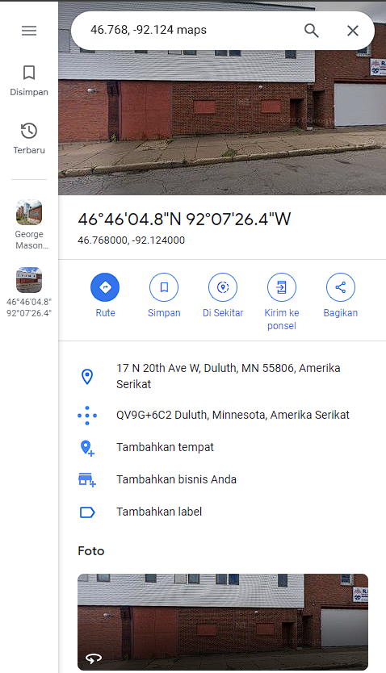

**Challenge**:

We were provided with an image file that appeared to contain an unusual cipher. To decrypt the message within the image, I utilized the [Gravity Falls Bill Cipher tool](https://www.dcode.fr/gravity-falls-bill-cipher).

By decoding the message from the image, I obtained a result like this:

'FOURSIX.SEVENSIXEGHT,-NINETWO.ONETWOFOUR'

At first, I had no clue about this decoded message. However, upon re-reading the challenge and noting the flag format 'PCTF{city_name}', I realized that the decoded message appeared to be a discombobulation. After converting the message, it resembled '46.768, -92.124'.

Indeed, these coordinates appeared to represent a location. I entered them into [Google Maps](https://www.google.com/maps/search/46.768,+-92.124+maps?sa=X&ved=2ahUKEwiXk6L08aCBAxWdxjgGHbkVBREQ8gF6BAgaEAA&ved=2ahUKEwiXk6L08aCBAxWdxjgGHbkVBREQ8gF6BAgbEAI) and discovered the following result:

Since the flag format specified a city name, I determined that the flag was [Duluth](https://en.wikipedia.org/wiki/Duluth,_Minnesota).

FLAG: PCTF{Duluth}