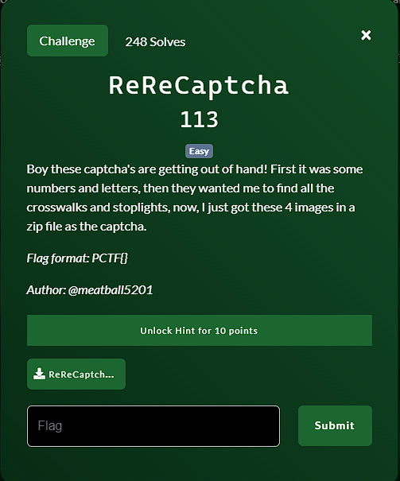
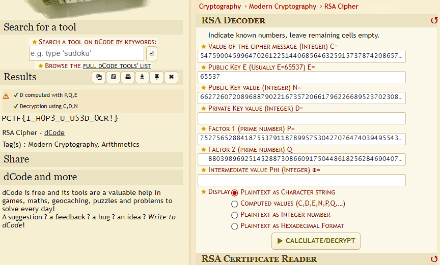

**Challenge**:

We were given a ZIP file for this challenge.
Extract it and you will get 4 images:
- CT.png  
- E.png  
- P.png  
- Q.png

If we open the file we will see a bunch of numbers. The challenge seems to be related to RSA when looking for the names of the files. Given the C, the E, the P and the Q, we have to find the N by multiplying the P and the Q.
Once we have the N, we can do the decryption of the message. I use this [SITE](https://www.dcode.fr/rsa-cipher) to solve it. I use this [SITE](https://www.editpad.org/tool/extract-text-from-image) to extract the text from these images.

FLAG: PCTF{I_H0P3_U_U53D_0CR!}