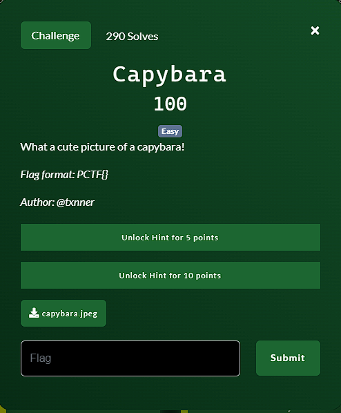
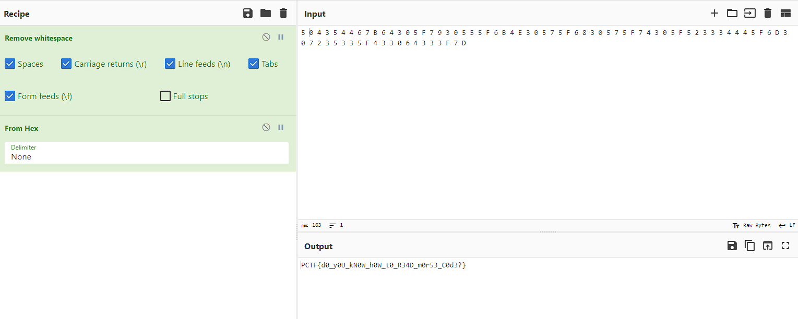

**Challenge**:

We were given an image file to work with. Using exiftool, strings and the binwalk command, I found an embedded file within the image file. I extract it using binwalk and open the audio file (WAV). The audio file sounds like Morse. Then use this [website](https://morsecode.world/international/decoder/audio-decoder-adaptive.html) to decode the Morse code.

After decoding the audio, I obtained the following result:
5 0 4 3 5 4 4 6 7 B 6 4 3 0 5 F 7 9 3 0 5 5 5 F 6 B 4 E 3 0 5 7 5 F 6 8 3 0 5 7 5 F 7 4 3 0 5 F 5 2 3 3 3 4 4 4 5 F 6 D 3 0 7 2 3 5 3 3 5 F 4 3 3 0 6 4 3 3 3 F 7 D

Converting this decoded Morse code to ASCII, I obtained the flag as shown in the provided image:

FLAG: PCTF{d0_y0U_kN0W_h0W_t0_R34D_m0r53_C0d3?}