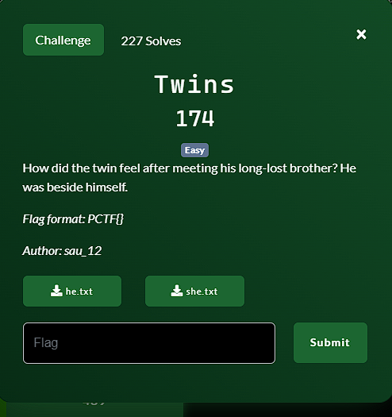

**Challenge**:

Given two files containing a story, you can use any text comparison website. In this challenge, I used [this one](https://text-compare.com/). After examining the files, you can construct the flag:

FLAG: PCTF{4wes0M3_sTories_man}
