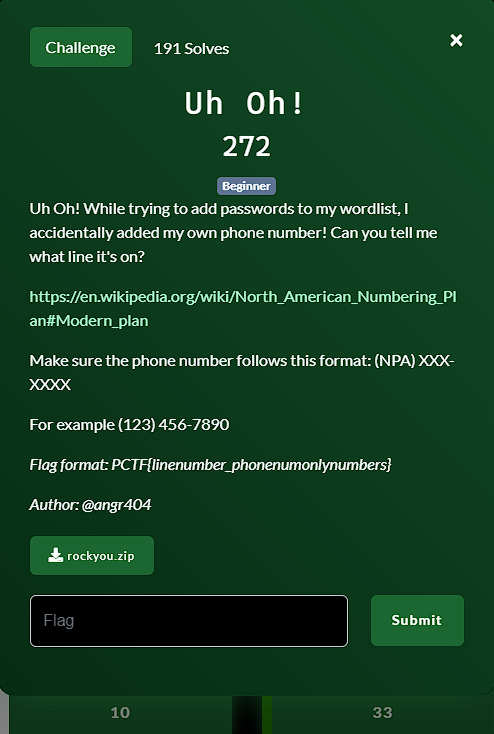

**Challenge**:



We were provided with a wordlist file and tasked with finding its corresponding phone number based on the North American Numbering Plan (NANP). Our goal was to check each line in the wordlist for a format matching a North American phone number, specifically: '(NPA) XXX-XXXX,' where 'NPA' represents the area code, and 'X' represents any digit.

If you encounter a line that matches the specified phone number format, your task is to extract the phone number and take note of the line number where it was found. Once you've identified the line containing the phone number, create the flag as follows: Replace 'linenumber' with the line number where you found the phone number, and replace 'phonenumonlynumbers' with the digits of the phone number, excluding any special characters.

To automate this process, I created a Python script as follows:

```
import re

# Open the rockyou.txt file for reading
with open("rockyou.txt", "r") as file:
    # Initialize line number
    line_number = 0

    # Loop through each line in the file
    for line in file:
        line_number += 1

        # Use regular expression to match the phone number format
        match = re.search(r'\((\d{3})\)\s(\d{3}-\d{4})', line)

        # If a match is found, extract the phone number
        if match:
            area_code = match.group(1)
            phone_digits = match.group(2)

            # Create the flag
            flag = f"PCTF{{{line_number}_{area_code}{phone_digits}}}"

            # Print the flag
            print("Found phone number on line", line_number)
            print("Flag:", flag)
```

FLAG: PCTF{7731484_4043037283}