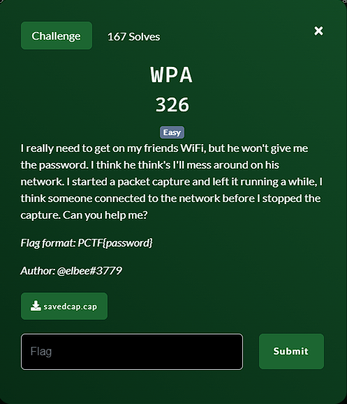
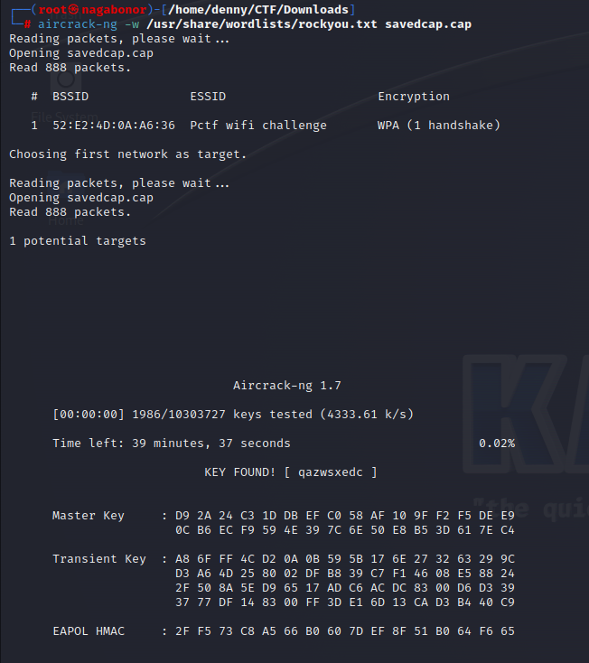

**Challenge**:



To solve this challenge, we need to analyze the packet capture file named 'savedcap.cap' to obtain the WPA passphrase (password) for the Wi-Fi network. To do this, I attempted to crack the WPA passphrase using the aircrack-ng tool.

```aircrack-ng -w /usr/share/wordlists/rockyou.txt savedcap.cap```

Execute this command, and you will obtain the password as shown in the image below:



FLAG: PCTF{qazwsxedc}

