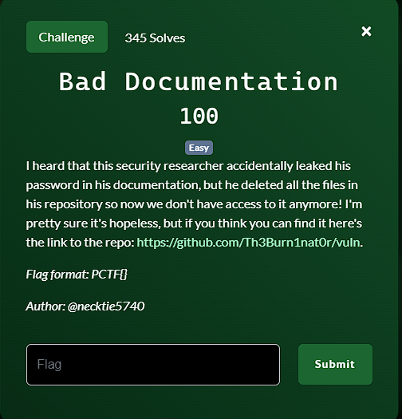
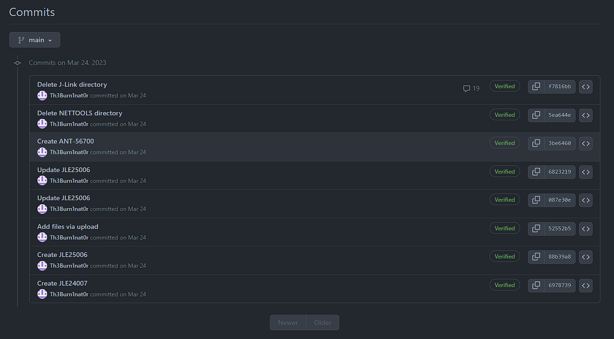
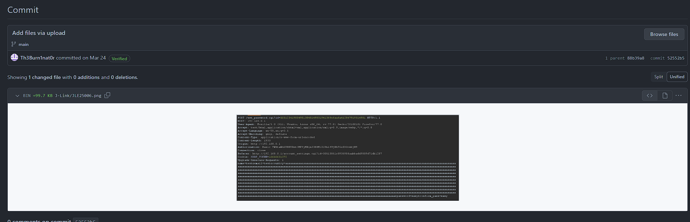
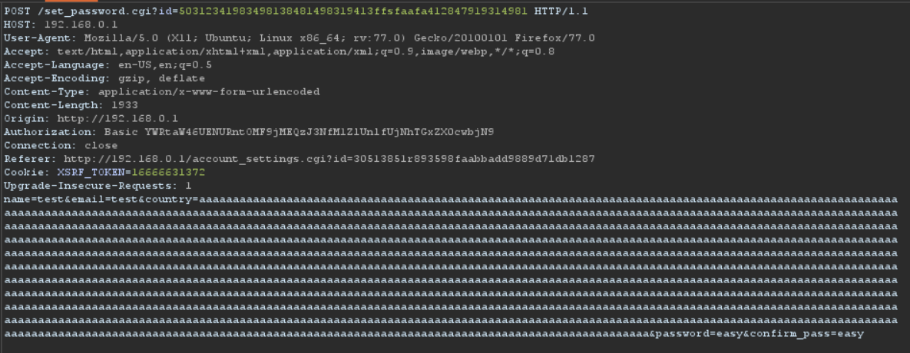
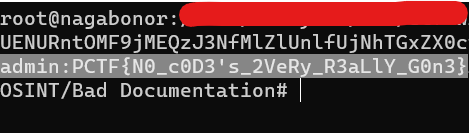

**Challenge**:



In this challenge, we were tasked with finding the password of a security researcher on their GitHub repository. My initial examination revealed that there were a total of 8 commits in the repository.



Upon inspecting all the commits, I came across one that seemed to provide a hint:





In this specific commit, the researcher was submitting a form to change their password to 'easy' and confirming it by entering 'easy' in both the 'password' and 'confirm_pass' fields. Naturally, I attempted to use 'easy' as the flag, but unfortunately, it turned out to be incorrect.

I also tried using the values of {id} from the first line of the request and the Referer header, but this didn't yield the correct answer either.

Then, I focused on the Authorization header values. It was only after analyzing the Authorization header values that I discovered it was encoded in Base64.

> YWRtaW46UENURntOMF9jMEQzJ3NfMlZlUnlfUjNhTGxZX0cwbjN9

I decoded it using the following command:
```
echo "YWRtaW46UENURntOMF9jMEQzJ3NfMlZlUnlfUjNhTGxZX0cwbjN9" | base64 -d
```
The decoded string revealed the flag:



The output from the decoded string is 'username:password'."

FLAG: PCTF{N0_c0D3's_2VeRy_R3aLlY_G0n3}