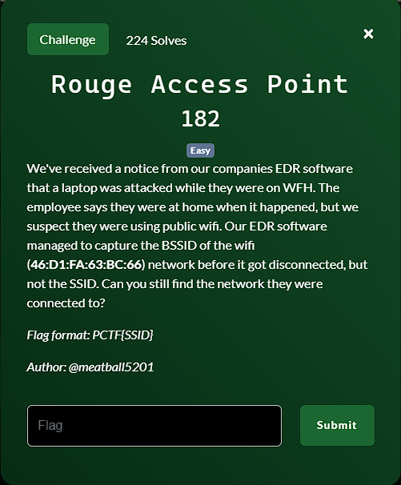
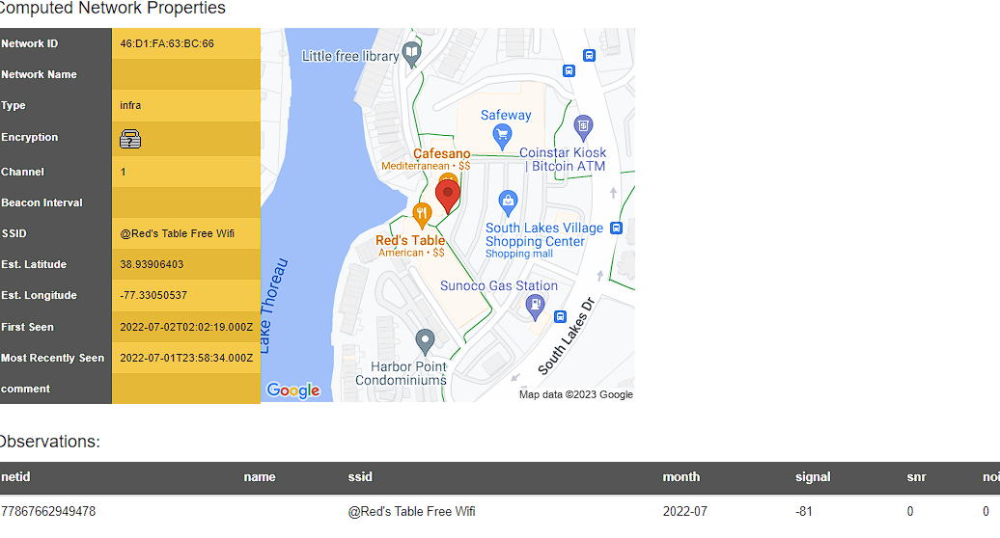

**Challenge**:

To obtain the SSID using the BSSID of the Wi-Fi network, follow these steps:

1. Note the BSSID of the Wi-Fi network.
2. Access the 'Advanced Search' feature in Wiggle.
3. Insert the BSSID into the search field.
4. After completing the search, you will retrieve the SSID as shown in the image below:

FLAG: PCTF{@Red's Table Free Wifi}