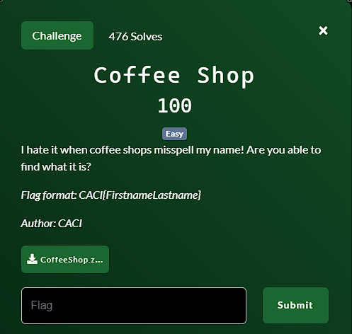
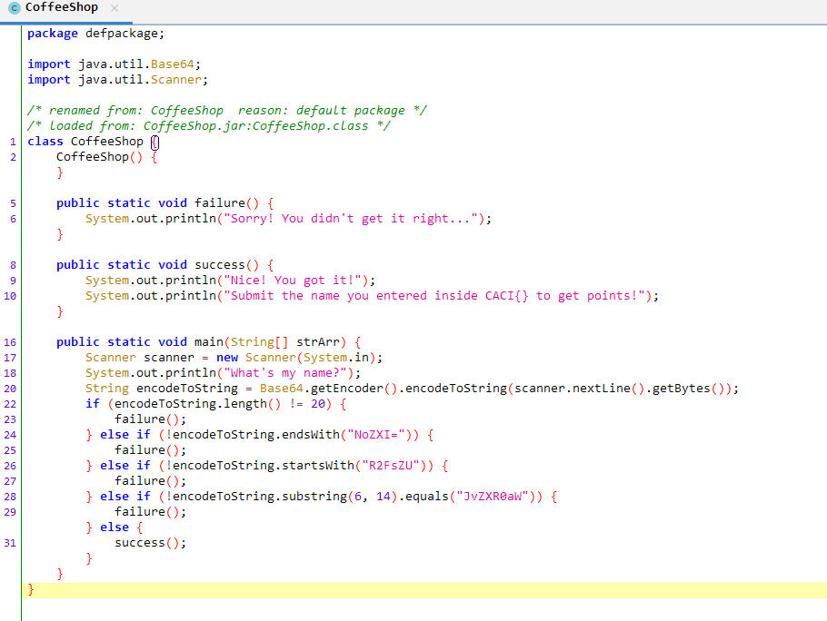

**Challenge**:



We were provided with a ZIP file that, upon extraction, a JAR file named 'CoffeeShop.jar.' When executed, this JAR file prompts the user to input a name and then checks if the input meets certain conditions outlined in the code.

Upon further investigation using JADX, we obtained the 'CoffeeShop.class' file, which appears as shown in the provided image.



```
    public static void main(String[] strArr) {
        Scanner scanner = new Scanner(System.in);
        System.out.println("What's my name?");
        String encodeToString = Base64.getEncoder().encodeToString(scanner.nextLine().getBytes());
        if (encodeToString.length() != 20) {
            failure();
        } else if (!encodeToString.endsWith("NoZXI=")) {
            failure();
        } else if (!encodeToString.startsWith("R2FsZU")) {
            failure();
        } else if (!encodeToString.substring(6, 14).equals("JvZXR0aW")) {
            failure();
        } else {
            success();
        }
    }
```

The Java code inside 'CoffeeShop.class' contains conditions that encode the user's input to Base64 and check if it meets specific criteria. If the conditions are not met, it executes the 'failure()' function; otherwise, it executes the 'success()' function.

I initially struggled to understand how to craft a name that would satisfy these conditions. However, I eventually realized that I could directly decode the required Base64 string: 
> R2FsZUJvZXR0aWNoZXI=

Decoding this string resulted in the name: 
> GaleBoetticher

According to the challenge description, we need to submit the flag in the format 'CACI{FirstnameLastname}'

Hence, the FLAG is: CACI{GaleBoetticher}