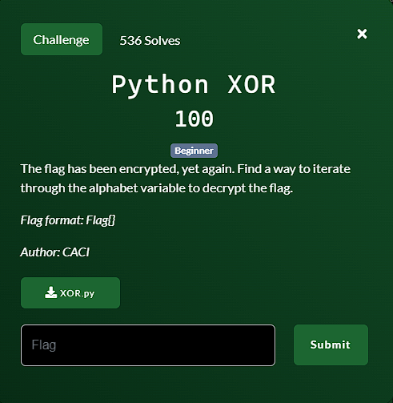

**Challenge**:



In this challenge, we are given a Python file named XOR.py.
The file itself looks like this.

```
from string import punctuation

alphabet = list(punctuation)
data = "bHEC_T]PLKJ{MW{AdW]Y"
def main():
#   For loop goes here
    key = ('')
    decrypted = ''.join([chr(ord(x) ^ ord(key)) for x in data])
    print(decrypted)
main()
```

This code is attempting to decrypt a message using XOR encryption, but it won't work as intended due to the use of an empty key. To decrypt the message correctly, you need to supply a valid key for the XOR operation. We can iterate through the 'alphabet' variable to find the correct XOR key. By performing the XOR operation between the encrypted data and the key, we can reveal the decrypted flag.

I created a solver program as follows:

```
from string import punctuation

alphabet = list(punctuation)
data = "bHEC_T]PLKJ{MW{AdW]Y"

def main():
    for key in alphabet:
        decrypted = ''.join([chr(ord(x) ^ ord(key)) for x in data])
        if "Flag{" in decrypted:
            print(decrypted)
            break

if __name__ == "__main__":
    main()
```

FLAG: Flag{python_is_e@sy}
