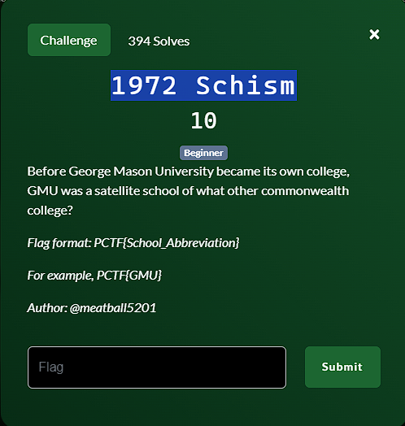

**Challenge**:

In order to gather historical context for this challenge, I referenced the official George Mason University website. This valuable source provided insights into GMU's early history, confirming that in 1972, it was a satellite school of another esteemed commonwealth college.

You can read more about it [here.](https://www.gmu.edu/about/legacy/history)

"In 1957, Mason was started as a branch campus of the University of Virginia. The school consisted of a single building and 17 students. Fifteen years later, on April 7, 1972, then-Governor A. Linwood Holton signed legislation to separate George Mason College from the University of Virginia."

Hence, the FLAG is PCTF{UVA}

