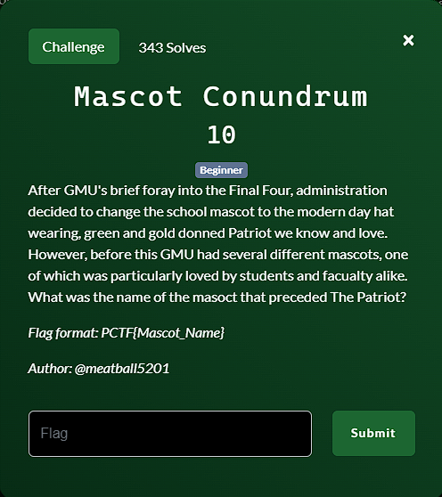

**Challenge**:

To successfully tackle this challenge, I began by thoroughly analyzing the information thoughtfully provided within the challenge description. It was evident from the details offered that the present-day mascot is known as "The Patriot."

My next step was to delve deeper into the history of GMU's mascots. I ventured onto the GMU website, where I discovered a comprehensive list of past mascots. The source I consulted for this was: [GMU Mascot Archives.](https://www.gmu.edu/news/2022-03/archives-history-mason-mascots)

The list of mascots I found on the website included:
- The Patriot
- Mason Maniak
- Mason Gorila
- The Green Mask
- Gunston

However, the challenge hinted at a particular mascot that held a special place in the hearts of both students and faculty. To pinpoint this beloved mascot, I expanded my search to other sources, including:
- A YouTube video: [GMU Mascot History Video](https://www.youtube.com/watch?v=cVlJadZE3nk)
- Comments on GMU's Facebook fanpage: [GMU Facebook Comments](https://www.facebook.com/georgemason/photos/a.47040579996/10151513578979997/?type=3 )

Upon analyzing the comments on the GMU Facebook fanpage, it became evident that Gunston was the mascot that resonated most deeply with the GMU community. Many individuals expressed their fondness for Gunston. Armed with this insight, I confidently submitted "Gunston" as the FLAG, and the submission proved to be successful.