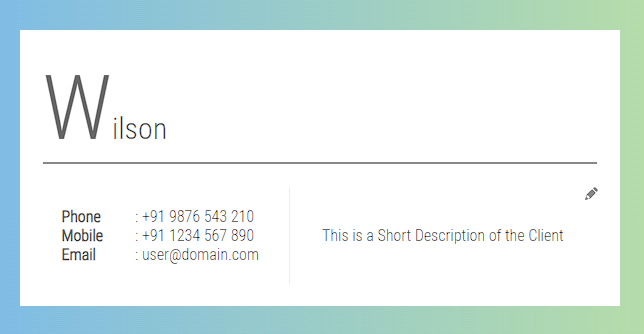
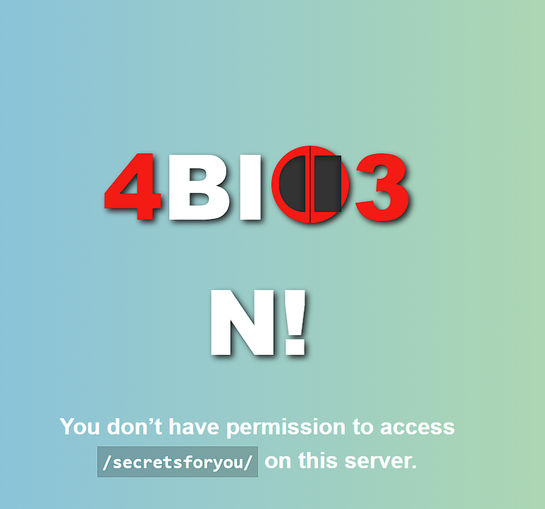

**Challenge**:


In this challenge, we need to find four pieces of the flag. To do this, I examine the various functionalities of this website. I also search for cookies and parameters. The default cookie is set as 'kiran.' When I tried to change its value to 'admin,' I obtained the first piece of the flag:

- PCTF{Hang_

Next, there is a profile menu on the website with a URL structure like this: http://chal.pctf.competitivecyber.club:9090/user?id=1. Based on the URL pattern, I attempted to change the user's ID to other numbers ranging from 1 to 50, but unfortunately, I found nothing. However, when I modified the starting point to 0, I managed to obtain the last flag using the collected pieces.

- ev3rYtH1nG}


The default user (id=1) looks like this:


The website also offers a search functionality allowing players to search for any users. In my initial attempt, I tried to perform SQL Injection using _sqlmap_. I used the following command:

I used this command:
```
sqlmap -u "http://chal.pctf.competitivecyber.club:9090/" --data "username=kiran" --method POST --level 2
```

Upon running sqlmap, I discovered that the database management system being used was SQLite. I then modified the command to find the tables:
```
sqlmap -u "http://chal.pctf.competitivecyber.club:9090/" --data "username=kiran" --method POST --level 2 --tables
```


Based on the image above, the table name is _accounts_. Using this table name, I proceeded to dump its contents:
```
sqlmap -u "http://chal.pctf.competitivecyber.club:9090/" --data "username=kiran" --method POST --level 2 -T accounts --dump
```


As you can see, there is another piece of the flag: 
- and_Adm1t_

Furthermore, there is another hint for finding another flag in the fourth row of the password column, indicating that we should navigate to the /secretsforyou path. When we visited the path, we received the following result:



Based on the image above, it appears to be related to a Path Traversal vulnerability. I attempted some basic exploitation using this [site](https://github.com/swisskyrepo/PayloadsAllTheThings/blob/master/Directory%20Traversal/README.md) and managed to bypass it with a semicolon ; until it looked like this:
> http://chal.pctf.competitivecyber.club:9090/secretsforyou/..;/

Then, I obtained another piece of the flag: 
- l00s3_

After several attempts in this challenge, we have collected all the pieces:
- PCTF{Hang_    [1]
- ev3rYtH1nG}   [4]
- and_Adm1t_    [3]
- l00s3_        [2]

Finally, we can assemble the correct flag by putting all the pieces together in the correct order:

FLAG: PCTF{Hang_l00s3_and_Adm1t_ev3rYtH1nG}

