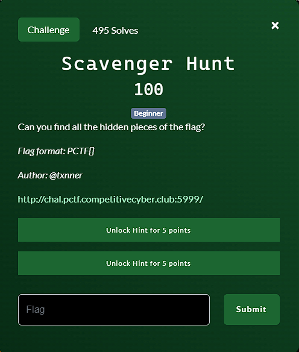

**Challenge**:



Given the challenge site: http://chal.pctf.competitivecyber.club:5999/

Upon visiting the site, we immediately obtain the first flag:
Flag 1/5 - PCTF{Hunt

To uncover the other flags, we need to delve into the source code. The second flag is cleverly hidden within HTML comments:

`<!-- Flag 2/5 - 3r5_4n -->`

Additionally, there are two Javascript files to inspect:
1. http://chal.pctf.competitivecyber.club:5999/script1.js
2. http://chal.pctf.competitivecyber.club:5999/script2.js

The first script reveals the fourth flag:

`console.log("Flag 4/5 - R5_e49");`

While the second script holds the fifth flag:

`document.cookie = "Flag 5/5=e4a541}";`

However, the third flag is still missing. In line with the nature of this "scavenger" challenge, I tried common paths often used in CTF challenges, such as robots.txt and sitemap.xml. It was when I explored /robots.txt that I uncovered the third flag:

```
# Flag 3/5 - D_g4tH3
User-agent: *
Disallow: /
```

FLAG: PCTF{Hunt3r5_4nD_g4tH3R5_e49e4a541}