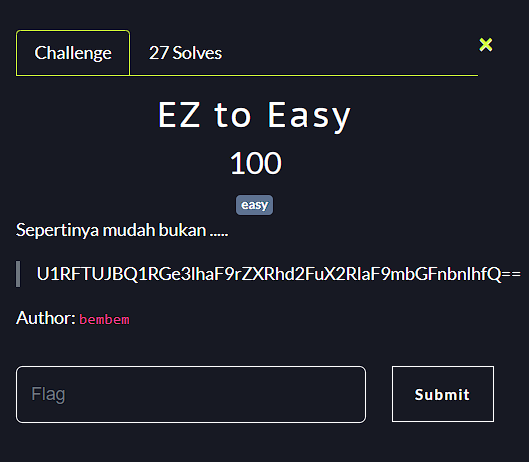

**Challenge**:

In this challenge given encoded strings.
"U1RFTUJBQ1RGe3lhaF9rZXRhd2FuX2RlaF9mbGFnbnlhfQ=="

In order to solve this challenge, we can use base64 decoding utility.
`echo "U1RFTUJBQ1RGe3lhaF9rZXRhd2FuX2RlaF9mbGFnbnlhfQ==" | base64 -d`

Finally, we got the flag: STEMBACTF{yah_ketawan_deh_flagnya}