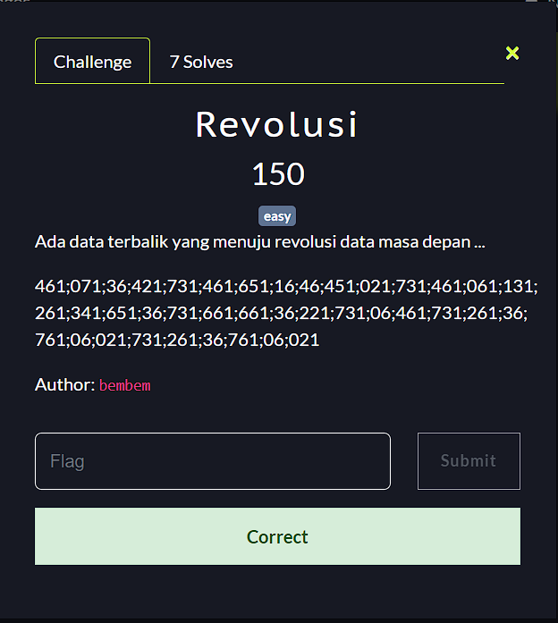
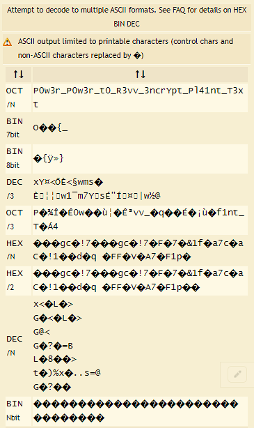

**Challenge**:

In this challenge, there is hint "terbalik" or "reversed" from its description. 
In order to solve this we should reverse the strings on the challenge so it will look like this:

>120;60;167;63;162;137;120;60;167;63;162;137;164;60;137;122;63;166;166;137;63;156;143;162;131;160;164;137;120;154;64;61;156;164;137;124;63;170;164;

Paste it to [here](https://www.dcode.fr/ascii-code) and finally we got the flag:

**FINAL FLAG**: STEMBACTF{P0w3r_P0w3r_t0_R3vv_3ncrYpt_Pl41nt_T3xt}
