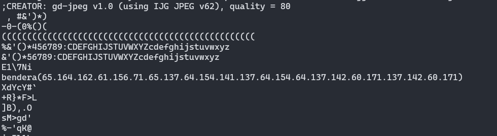

**Challenge**:

In this challenge, we've given _Triplemini.jpg_ file.
In order to solve this challenge, I did several steps to analyze this image.

1. First, I use `file` to check out what kind of file do we have.
2. Then, I use exiftool to view file metadata.

From the result above there is no suspicious information that helps us solve or investigate this further.
3. I started using `string` to extract strings from the file. When I using this command, I didn't pay much attention to the content because it was too long. Then, I figured out how to extract the string with a predetermined length. Using this command `strings -n 6 file`. After using the command, there is a strings that is quite interesting. You can see it in the image below:

Yeah, it's **"bendera(65.164.162.61.156.71.65.137.64.154.141.137.64.154.64.137.142.60.171.137.142.60.171)"**. 

In Bahasa Indonesia *bendera* means flag, so I assumed that this was the flag we had been looking for. However, given that the flag format used in this competition is STEMBACTF{}, it can be concluded that this string has been encoded into another form. To decode this string I tried to identify it through [this site](https://www.dcode.fr/cipher-identifier) and there are some suggested results such as:

Then, I experimented with Prime Numbers Cipher and ASCII Code. I didn't get the flag in Prime Numbers Cipher but in ASCII Code I got the flag:

**FINAL FLAG**: STEMBACTF{5tr1n95_4la_4l4_b0y_b0y}

*Notes*:  
I learned a lot from this challenge about the further use of command `strings` as well as ASCII Code. Honestly, I still have lack knowledge in the field of cryptography and forensics. I would appreciate any feedback on resources for learning about cryptography and forensics or improving this article. Thank you!

