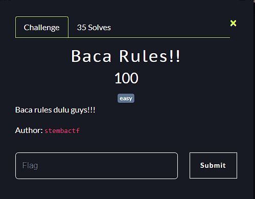
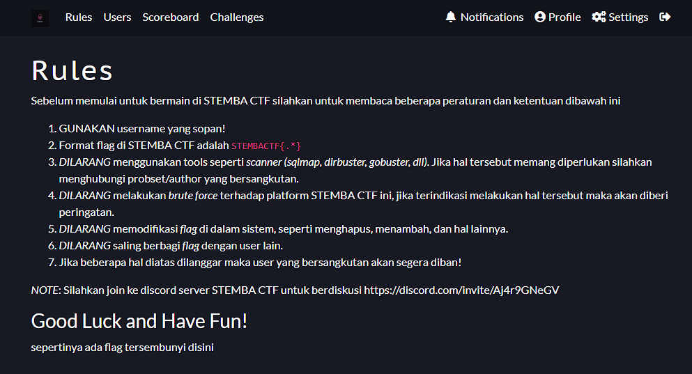

**Challenge**: 

.

To get the flag in this challenge we first go to the Rules menu.
On this page there is a hint *"there seems to be a hidden flag here".* 
We can look at the *source* or *inspect element* and then get the flag:

**FINAL FLAG**: STEMBACTF{t4at1_per47uran_k4al4u_t1d4k_n4nt1_d1ban}

