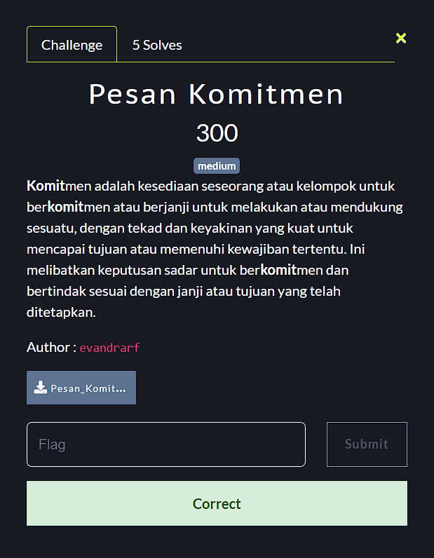

**Challenge**:

In this challenge, we are given a file called Pesan_Komitmen.zip. If we extract the file, we will find 1 folder and 2 files, namely:
- .git
- index.html
- README.md

After checking the two files, there is no information containing hints or flags from this challenge. Then, I paid attention to the .git folder. Based on the description given in the challenge, it seems that the author often repeats the word "commit" which I assume refers to "commit" in Git. Using `git log | grep commit` I found 61 lines of commits. Then, I started to explore the content of those commits. In the end, I didn't find any flags. At first I didn't realize the commit message of each commit until when I sorted them from first commit to last commit and they all led me to information that could be a hint in this challenge. Yes, that's right, it formed a string in the form of:
U1RFTUJBQ1RGe2Izcm00aW5fZDNuZzRuX2cxdF9jMG1taXRfbTNzNWFnM30=

Well, sure enough, this is an encoded string. By using the command `echo "U1RFTUJBQ1RGe2Izcm00aW5fZDNuZzRuX2cxdF9jMG1taXRfbTNzNWFnM30=" | base64 -d` the flag is obtained:

**FINAL FLAG**: STEMBACTF{b3rm4in_d3ng4n_g1t_c0mmit_m3s5ag3}