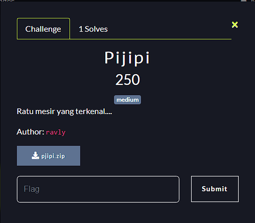
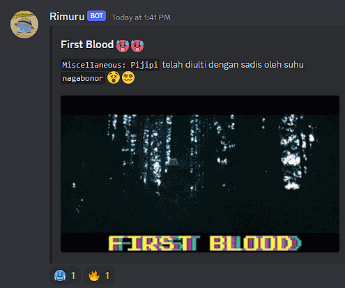
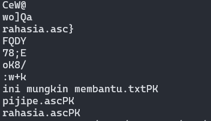
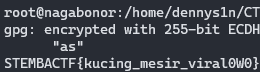

**Challenge**:

I just got first kill on this challenge.

In this challenge there is pjipi.zip file. 
Unzip it and we got two files:
- srek-ayank.jpeg
- hint.txt

The image file is just a normal image while the content of hint.txt looks like:
>Kleopatra VII Filopator adalah penguasa aktif terakhir Kerajaan Wangsa Ptolemaios di tanah Mesir. Kleopatra juga seorang diplomat, laksamana, administrator, poliglot, dan pujangga ilmu pengobatan.

Then, I analyzed the image file using exiftool. I didn't get any hints to help us. Then I moved forward using strings command and got this result.

I assumed there were 3 files stored or embedded in this image file such as:
- ini mungkin membantu.txt
- pijipe.asc
- rahasia.asc

To solve this challenge, it appears that we have a set of PGP keys and an encrypted PGP message. The objective is to decrypt the message using the private key.

Here's the step-by-step process to solve this:
1. Import the Public Key:
> gpg --import pijipe.asc
2. Import the Private Key:
> gpg --import rahasia.asc
3. Decrypt the Message:
> gpg --decrypt ini\ mungkin\ membantu.txt
Finally, we got the flag:

**FINAL FLAG**: STEMBACTF{kucing_mesir_viral0W0}