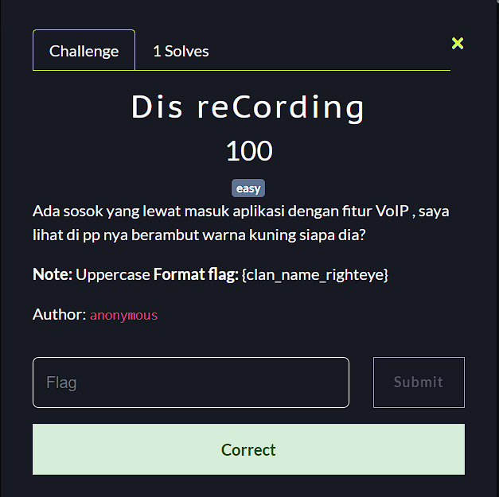
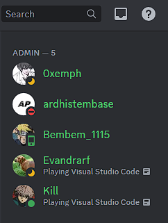
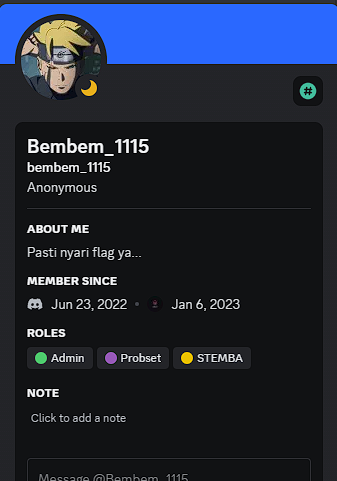
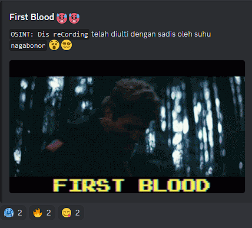

**Challenge**: 

In this challenge, it is said that "there is a figure passing through the application with the VoIP feature, I see the profile picture with yellow hair, who is he?"

First of all, if we look at the title of this challenge "Dis reCording" refers to the "DisCord" application. My assumption is that this is strongly related to the challenge description about "VoIP" because Discord is a VoIP and we are asked to find users who have profile pictures with **yellow hair**.  

After searching for a while in the Discord member list, I finally found a user with the conditions mentioned in the challenge description.

Yeah, as you can see the user with the name **Bembem_1115** has a profile picture that matches what is requested in the challenge, which is yellow hair. 

If we look closely at the image below there are Pronouns "Anonymous" which is the same as the name of the author of this challenge. In the image below there is also information in the form of *"Pasti nyari flag ya..."* which gives a strong indication that this user is the one we are looking for.

The picture that the user used in his profile was of Uzumaki Boruto tying his headband.
Based on the flag format in this challenge:

*Note: Uppercase Flag format: {clan_name_righteye}*, then the flag is:

**FINAL FLAG**: STEMBACTF{UZUMAKI_BORUTO_JOUGAN}

And yeah, this is the second time I got first blood in this CTF event after **Pijipi's challenge**. 

