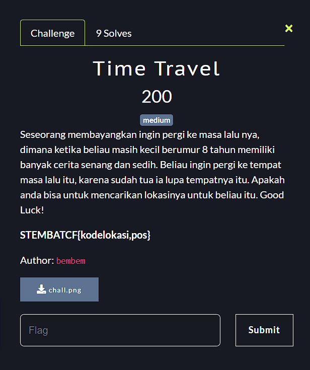
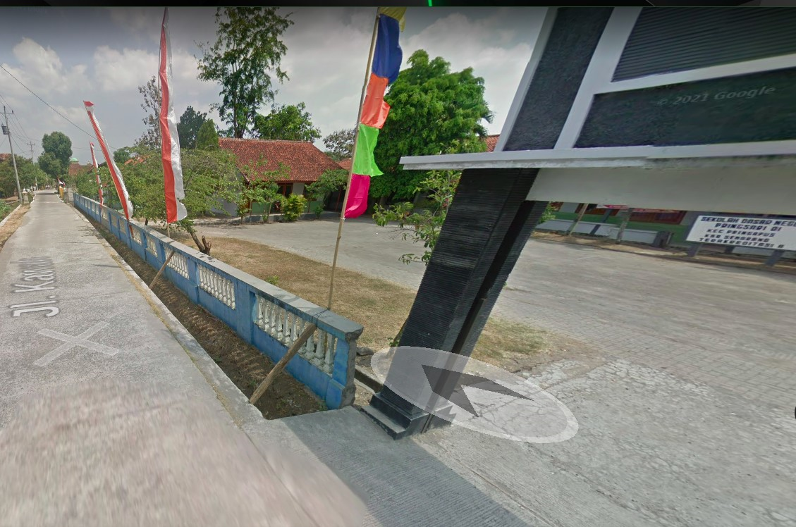
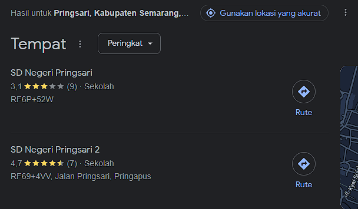
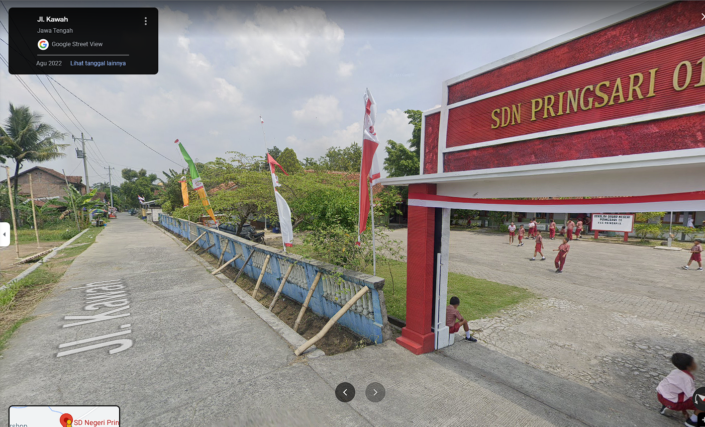
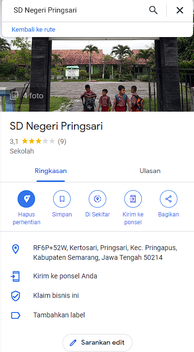

**Challenge**:

This is chall.png looks like:

How to solve?

We can obtain several informations from this image.
As we can see, there is a sign (I'll write in Bahasa Indonesia):
- pagar biru 
- bendera yang berkibar
- alamat jalan
- alamat SD: Sekolah Dasar Negeri _..._ Pringsari Di Kec. Pringapus.

With these informations we can continue our investigation. 
When I search on Google using keyword "sekolah dasar negeri pringsadi di kec kec. pringapus" I got 2 results on top:

Then, I use SD Negeri Pringsari as my first target. When I opened it on Google Maps I got similar looks to _chall.png_.
As you can see there is still same information we obtained from the _chall.png_ file:

- pagar biru
- bendera yang berkibar
- alamat jalan

If you look carefully, there is a differences between the sign of this school from previous image. The sign in this image has black color while the _chall.png_ has blueish (idk lol) color. The school gate also has red and white color while the _chall.png_ has black and white color. Thus, with this information I am pretty sure this is our target. 

Using FLAG Format as STEMBACTF{kodelokasi,pos}, there is "kode lokasi" (location code) and "kode pos" (zip code) in this place as you can see below:

Kode lokasi (location code): RF6P+52W  
Kode pos (zip code): 50214

**FINAL FLAG**: STEMBACTF{RF6P+52W,50214}