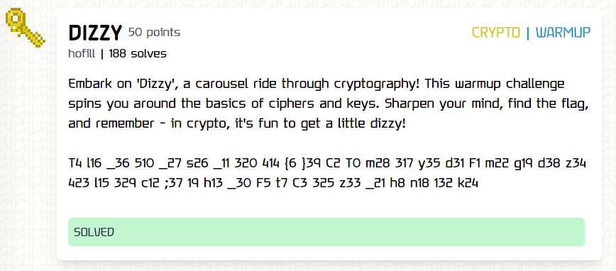
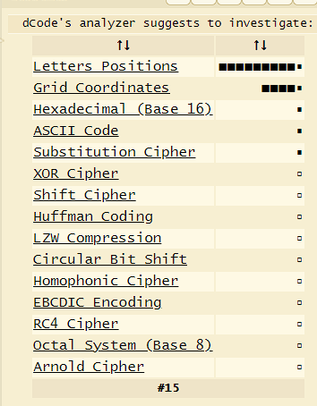
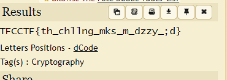

**Challenge**: 

I copied the ciphertext to this [site](https://www.dcode.fr/cipher-identifier) to analyze it.

The dCode's analyzer suggests to investigate:

Then I pasted it into the Letters Position Decoder and got this:

When I tried to submit it for the CTF challenge, it was rejected because the flag was incorrect. So, I started examining the missing characters through trial and error until I finally submitted the correct flag as below (lol).

FLAG: TFCCTF{th15_ch4ll3ng3_m4k3s_m3_d1zzy_;d}