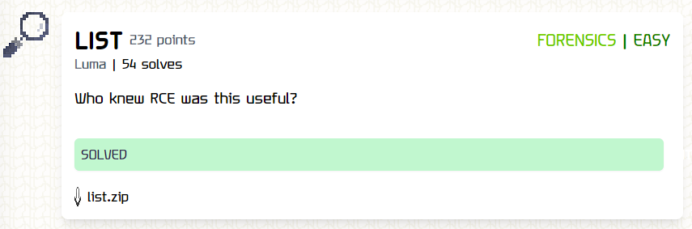
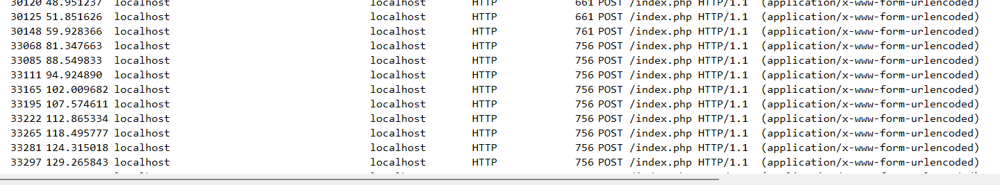
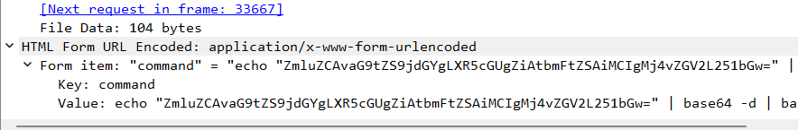
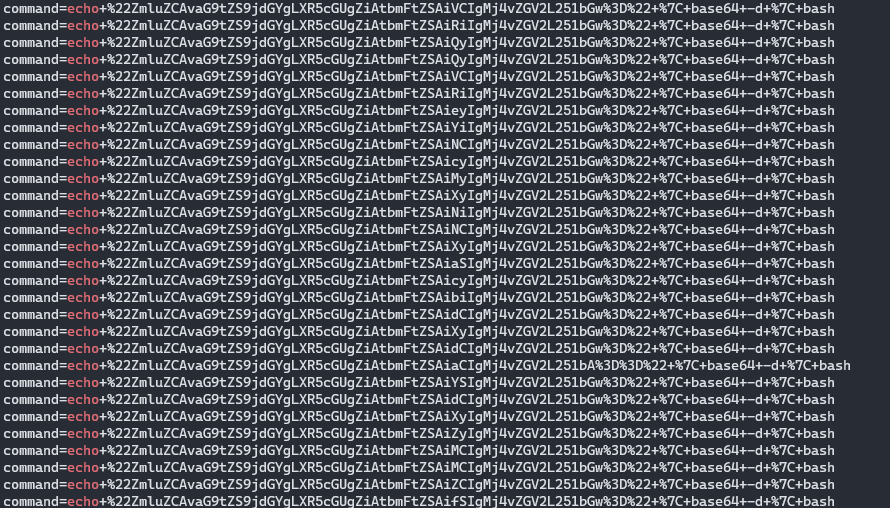
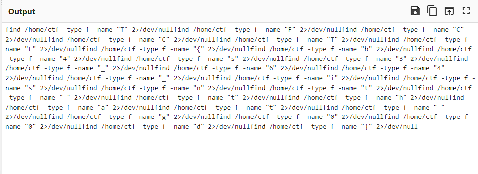
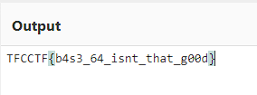

**Challenge**:

In this challenge, we were given a file called "list.zip," which contains a PCAP file. The challenge's description mentioned "Who knew RCE was this useful?", leading me to focus on the HTTP filter. I opened the PCAP file using Wireshark and applied the HTTP filter to examine each packet.

At first, I didn't notice anything significant until I came across the following sequence of packets:

I observed that each packet contained a URL encoded in the form, and it was evidently encoded in base64. To begin my investigation, I decoded two packets that had the same content. Upon careful examination, it appeared to be part of the flag.

Since numerous packets contained similar content, I used the following command:
`strings list.pcap | grep "echo"`

Then, I copied those strings into CyberChef, removed unnecessary words such as:
- command=echo+%22
- %22+%7C+base64+-d+%7C+bash
I replaced the URL-encoded string "%3D" with "=", and then used the base64 decode utility.

After decoding from base64, the result looked like this:

The flag is located after the "-name" command. If you remove the unnecessary strings, you will obtain the final flag.

FLAG: TFCCTF{b4s3_64_isnt_that_g00d}