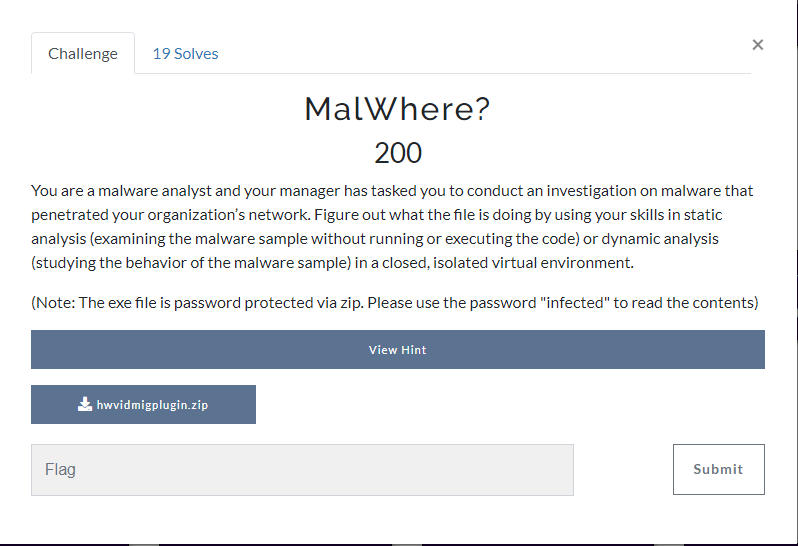

In this challenge, we are given with a `hwvidmigplugin.zip` file.
After extracting the file, we got an executable files.

Since the author said this is about malware sandboxes and stuff about it, I decided to upload this file into any interactive malware analysis website.

I used this website and upload the file: https://www.hybrid-analysis.com/

After uploading the file, I got the result or you can see here: 
https://www.hybrid-analysis.com/sample/803b90fbde5f104e549242c8cb54b4422d1ca1afa2b49dad492e0e4160461d70/65fef01e618ca9d42c0687d1

On the `Extracted Strings` tab, we got bunch of strings and one is caught my attention. It's the `txt.galf` which contains 2 strings:
- texsaw{p0wErSuRgE}
- ÿþtexsaw{p0wErSuRgE}

To be honest, I dont really have much knowledge in the malware field so I attempt this string to the CTF website and it turns out we just got the correct flag.

flag: texsaw{p0wErSuRgE}
