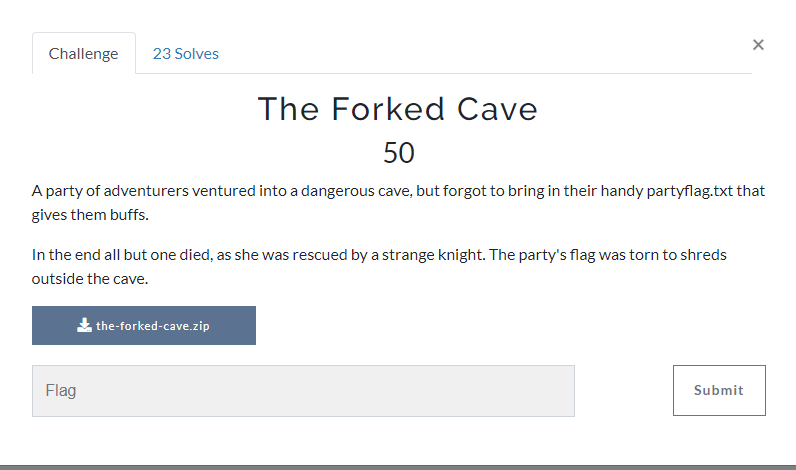

We are given a ZIP file.
After extracting the file, we got a `.git` folder.

For me, the challenge is obvious. The flag was modified and we are given with a `git` folder. So we need to recover or restore the target file. I found this article which discuss about exposed and exploit a `.git`: https://medium.com/stolabs/git-exposed-how-to-identify-and-exploit-62df3c165c37

First, I checked all commits by using `git log` command:


After that, I read all commits by using `git show [commit id]`. The first commit was looked like this:

```
Author: Chris Wang <chriswang444@gmail.com>
Date:   Fri Oct 19 16:01:50 2018 -0500

    Something went very wrong.

diff --git a/brawler.txt b/brawler.txt
deleted file mode 100644
index c710567..0000000
--- a/brawler.txt
+++ /dev/null
@@ -1 +0,0 @@
-I'm not prepared for the big enemies yet...
diff --git a/creeper.txt b/creeper.txt
deleted file mode 100644
index 270157b..0000000
--- a/creeper.txt
+++ /dev/null
@@ -1 +0,0 @@
-C3H5N3O9
diff --git a/demon.txt b/demon.txt
deleted file mode 100644
index 83a94f9..0000000
--- a/demon.txt
+++ /dev/null
@@ -1 +0,0 @@
-If you aren't Doomguy, I can kill you.
diff --git a/goblin.txt b/goblin.txt
deleted file mode 100644
index a5d57a2..0000000
--- a/goblin.txt
+++ /dev/null
@@ -1 +0,0 @@
-*GOBLIN NOISES*
diff --git a/knight.txt b/knight.txt
new file mode 100644
index 0000000..6c9265e
--- /dev/null
+++ b/knight.txt
@@ -0,0 +1 @@
+We'll kill them one by one...
diff --git a/partyflag.txt b/partyflag.txt
new file mode 100644
index 0000000..bd10ada
--- /dev/null
+++ b/partyflag.txt
@@ -0,0 +1 @@
+texsaw{git_r3set_f_htb_qwltf}
diff --git a/priestess.txt b/priestess.txt
index d3e36b7..09c909a 100644
--- a/priestess.txt
+++ b/priestess.txt
@@ -1 +1 @@
-I can't cure status ailments...
+I've seen things I shouldn't have...
diff --git a/skeleton.txt b/skeleton.txt
deleted file mode 100644
index 02057f0..0000000
--- a/skeleton.txt
+++ /dev/null
@@ -1 +0,0 @@
-I'm Sans Undertale. Get ready to have a bad time.
diff --git a/soldier.txt b/soldier.txt
deleted file mode 100644
index 749e0b5..0000000
--- a/soldier.txt
+++ /dev/null
@@ -1 +0,0 @@
-My broadsword is too big for CQC...
diff --git a/wizard.txt b/wizard.txt
deleted file mode 100644
index 9657cfa..0000000
--- a/wizard.txt
+++ /dev/null
@@ -1 +0,0 @@
-I can take on a few, but I can't take on twenty...
(END)
```

We got a torned flag from the first commit:
`texsaw{git_r3set_f_htb_qwltf}`

Then, I proceed to the second commit:


```
Author: Chris Wang <chriswang444@gmail.com>
Date:   Fri Oct 19 16:01:12 2018 -0500

    The battle begins!

diff --git a/creeper.txt b/creeper.txt
new file mode 100644
index 0000000..270157b
--- /dev/null
+++ b/creeper.txt
@@ -0,0 +1 @@
+C3H5N3O9
diff --git a/demon.txt b/demon.txt
new file mode 100644
index 0000000..83a94f9
--- /dev/null
+++ b/demon.txt
@@ -0,0 +1 @@
+If you aren't Doomguy, I can kill you.
diff --git a/goblin.txt b/goblin.txt
new file mode 100644
index 0000000..a5d57a2
--- /dev/null
+++ b/goblin.txt
@@ -0,0 +1 @@
+*GOBLIN NOISES*
diff --git a/partyflag.txt b/partyflag.txt
deleted file mode 100644
index f39f6b2..0000000
--- a/partyflag.txt
+++ /dev/null
@@ -1 +0,0 @@
-texsaw{git_g00d_or_git_d3ath}
diff --git a/skeleton.txt b/skeleton.txt
new file mode 100644
index 0000000..02057f0
--- /dev/null
+++ b/skeleton.txt
@@ -0,0 +1 @@
+I'm Sans Undertale. Get ready to have a bad time.
```
From the second commit, we got the original flag: texsaw{git_g00d_or_git_d3ath}

While the third commit, the "flag" is seems same as the second flag from second commit: 


```
Author: Chris Wang <chriswang444@gmail.com>
Date:   Fri Oct 19 16:00:28 2018 -0500

    The party enters the cave.

diff --git a/brawler.txt b/brawler.txt
new file mode 100644
index 0000000..c710567
--- /dev/null
+++ b/brawler.txt
@@ -0,0 +1 @@
+I'm not prepared for the big enemies yet...
diff --git a/partyflag.txt b/partyflag.txt
new file mode 100644
index 0000000..f39f6b2
--- /dev/null
+++ b/partyflag.txt
@@ -0,0 +1 @@
+texsaw{git_g00d_or_git_d3ath}
diff --git a/priestess.txt b/priestess.txt
new file mode 100644
index 0000000..d3e36b7
--- /dev/null
+++ b/priestess.txt
@@ -0,0 +1 @@
+I can't cure status ailments...
diff --git a/soldier.txt b/soldier.txt
new file mode 100644
index 0000000..749e0b5
--- /dev/null
+++ b/soldier.txt
@@ -0,0 +1 @@
+My broadsword is too big for CQC...
diff --git a/wizard.txt b/wizard.txt
new file mode 100644
index 0000000..9657cfa
--- /dev/null
+++ b/wizard.txt
@@ -0,0 +1 @@
+I can take on a few, but I can't take on twenty...
```

flag: texsaw{git_g00d_or_git_d3ath}