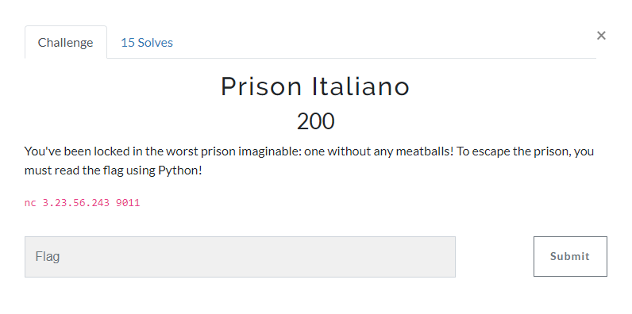
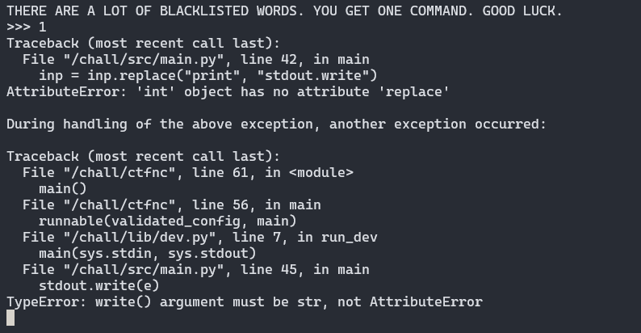
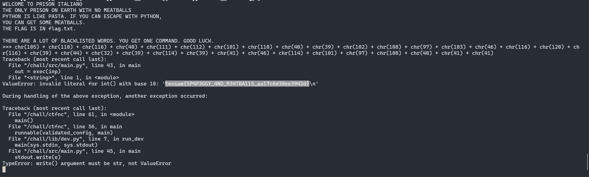

It's a PyJail challenge and we need to escape and read `flag.txt`.

If we attempt the challenge, we need to supply an input:


I tried several payloads to find any blacklisted characters or strings and when I inserted a number it revealed an error message:



The error occurs because the program is trying to call the replace method on an integer. In Python, the replace method is a string method, which means it can only be called on string objects. When you input a number, it is treated as an integer, not a string. Therefore, when the program tries to call inp.replace("print", "stdout.write"), it raises an AttributeError because the integer object inp does not have a replace method.

The second error, `TypeError: write() argument must be str, not AttributeError`, occurs when the program tries to write the AttributeError object to stdout using the write() function. The write() function expects a string as an argument, but it’s being given an AttributeError object, which is not a string. This is why the TypeError is raised.

In summary, the program is not properly handling non-string inputs and exceptions, which is causing these errors.

After a lot trial and error, I tried to convert `int(open('flag.txt', 'r').read())` to the ascii code and used `chr(number)` to convert each ascii code back to the original character. So the final payload is:
```
chr(105) + chr(110) + chr(116) + chr(40) + chr(111) + chr(112) + chr(101) + chr(110) + chr(40) + chr(39) + chr(102) + chr(108) + chr(97) + chr(103) + chr(46) + chr(116) + chr(120) + chr(116) + chr(39) + chr(44) + chr(32) + chr(39) + chr(114) + chr(39) + chr(41) + chr(46) + chr(114) + chr(101) + chr(97) + chr(100) + chr(40) + chr(41) + chr(41)
```

I got this from this writeup: https://ctftime.org/writeup/16199

However, there are a few things to consider:
- The content of "flag.txt" might not be a valid integer. If it contains letters, symbols, or multiple numbers, int() will raise a ValueError.
- This code assumes the file exists and is readable. It doesn't handle potential errors like file permissions or the file not being found.

### Possible scenario:
- If "flag.txt" contains the number "1337", the code would successfully convert it to the integer 1337.
- If "flag.txt" contains "This is a flag!", int() will fail because it cannot convert text to a number.

Insert the final payload:



The error message is trying to convert the content of flag.txt to an integer, which is not possible and hence, raises a ValueError. This error is then unsuccessfully attempted to be written to stdout causing a TypeError, but not before revealing the flag in the process.

flag: texsaw{SP4P3GGY_4ND_M34TBA11S_aa17c6d30ee3942d}