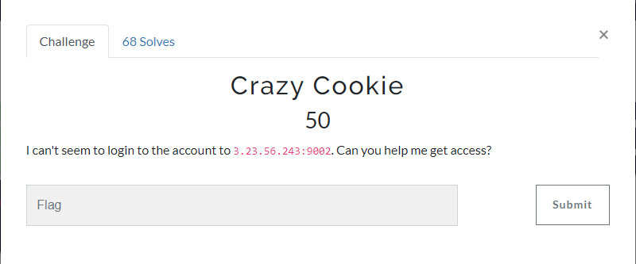
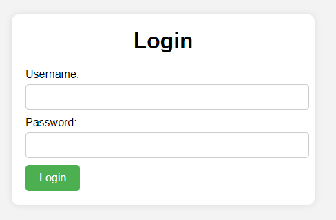
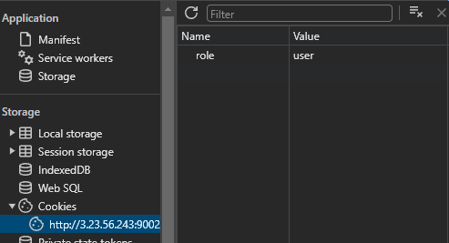
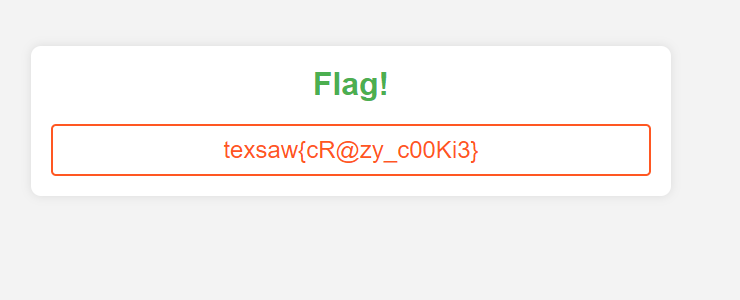

the challenge's website:

The challenge is so obvious and to solve this we just check the cookie's value from Developer Tools.

Then, change it to `admin`.

After changing the cookie:

flag: texsaw{cR@zy_c00Ki3}
