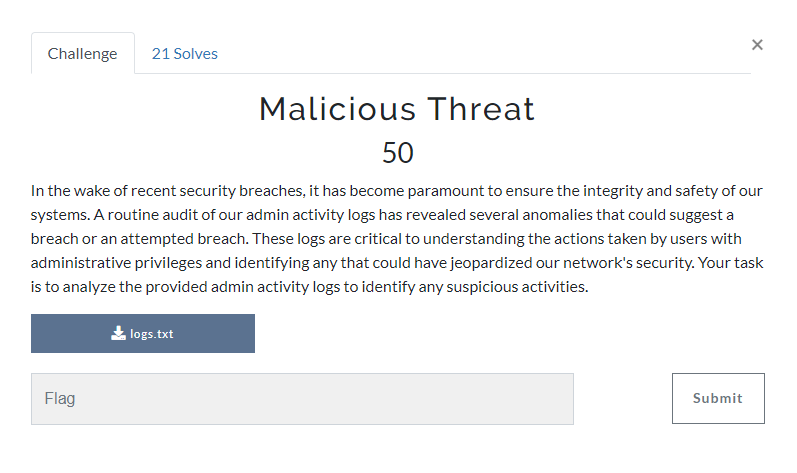
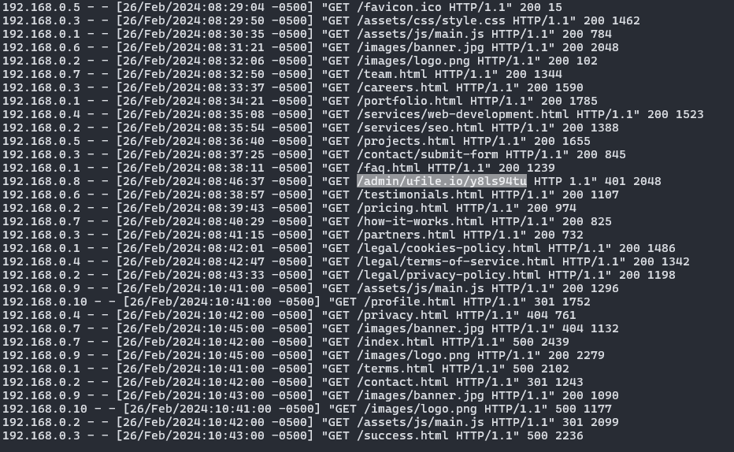
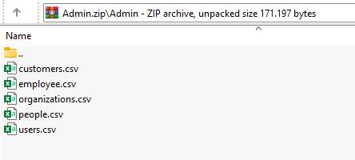
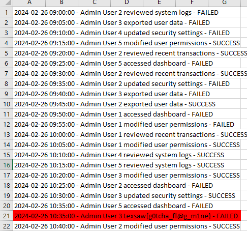

We are given a `logs.txt` file.

Upon analyzing this file, I got a suspicious endpoint:

`/admin/ufile.io/y8ls94tu`

Then, I removed the `admin` part and accessing the site.

As we can see, we got Admin.zip that we could download. After downloaded the file, we got 5 CSV files inside the archive file:

Analyzing file by file, I got the flag inside the `users.csv` file. It has 61 lines and the flag is on 21th line.

flag: texsaw{g0tcha_fl@g_m1ne}

