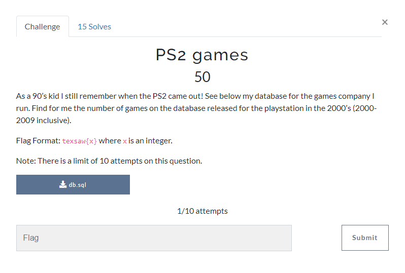

We are given a `db.sql` file. To solve it run this sql script:

```
SELECT COUNT(*)
FROM Games AS g
JOIN GamePlatforms AS gp ON g.game_id = gp.game_id
JOIN Platforms AS p ON gp.platform_id = p.platform_id
WHERE p.platform_name = 'PlayStation'
AND YEAR(g.release_date) BETWEEN 2000 AND 2009;
```


flag: texsaw{42}
