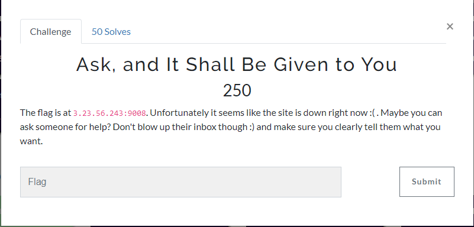

In this challenge, we are given with a website.
The website doesn't contains anything and it looks like this:

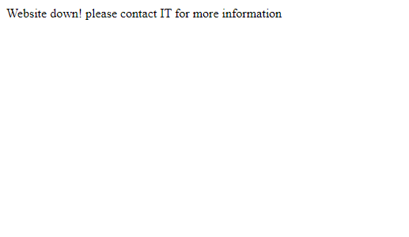

Then, I start to fuzzing all possible directories and it has `robots.txt`:

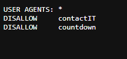


1. /contactIT
    
    When we visit this endpoint, it will looks like this:

    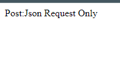
    
    So, in order to access this endpoint, we should make a POST request to the provided endpoint with JSON data.

    My first attempt looks like this:

    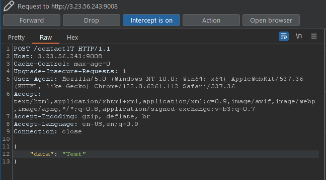

    When I did intercept the request, the response was looked like this:

    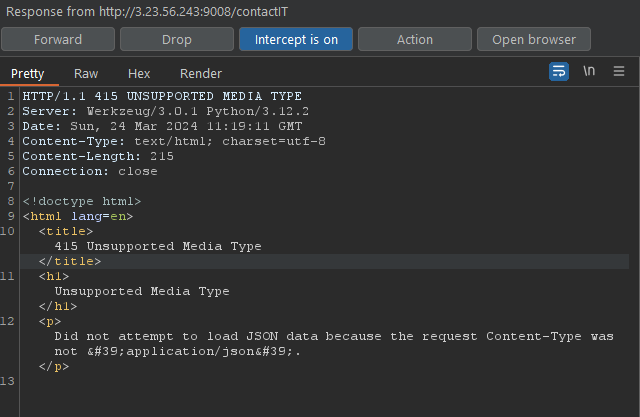

    We need to provide a Content-Type header and the value is `application/json`. After changing the request, we got response like this:

    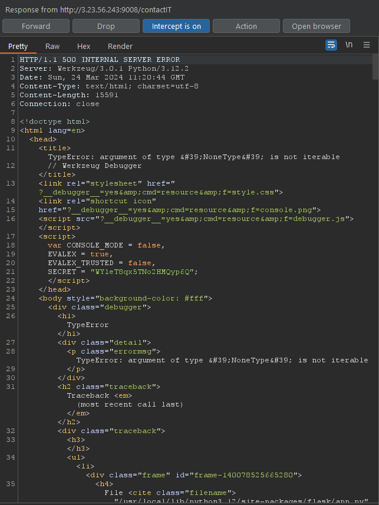

    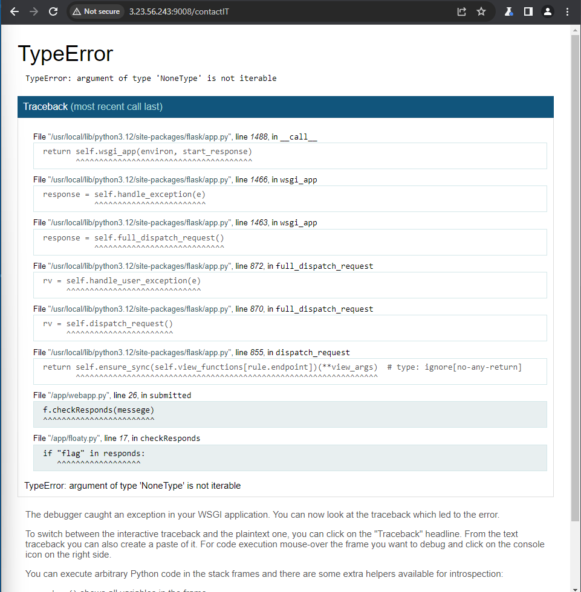

    So, it turns out the website using Werkzeug and reveals some errors. Based on the error message, it seems like the server is expecting a JSON object with two properties: email and messege. The messege property should contain the word “flag” to trigger the sendFlag() function. 

    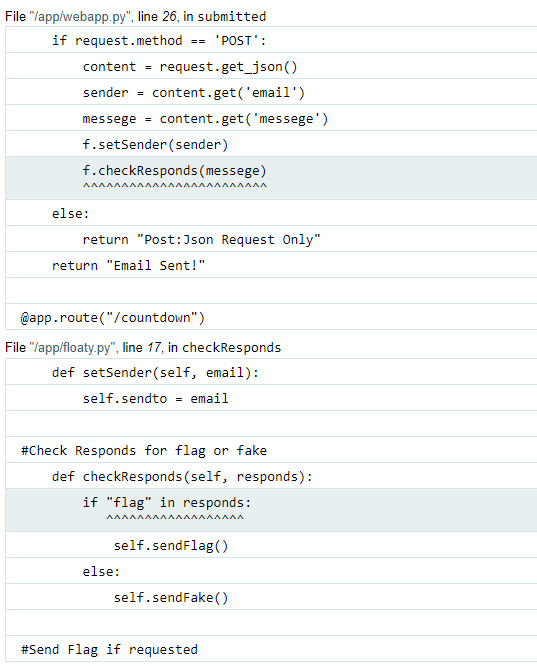

    Now, we have a clear path how to obtain the flag. We only modify the request and provide the correct JSON objects:
    
    ```
    {
        "email": "your-email@example.com",
        "messege": "Please send the flag."
    }
    ```

    The full request will be look like this:

    ```
    POST /contactIT HTTP/1.1
    Host: 3.23.56.243:9008
    Cache-Control: max-age=0
    Upgrade-Insecure-Requests: 1
    User-Agent: Mozilla/5.0 (Windows NT 10.0; Win64; x64) AppleWebKit/537.36 (KHTML, like Gecko) Chrome/122.0.6261.112 Safari/537.36
    Accept: text/html,application/xhtml+xml,application/xml;q=0.9,image/avif,image/webp,image/apng,*/*;q=0.8,application/signed-exchange;v=b3;q=0.7
    Accept-Encoding: gzip, deflate, br
    Accept-Language: en-US,en;q=0.9
    Connection: close
    Content-Type: application/json

    {
        "email": "your-email@example.com",
        "messege": "Please send the flag."
    }
    ```

    To get the flag, just change the email value to your email and send the request. I also wrote a solver for this challenge:

    ```
    import requests
    import json

    url = "http://3.23.56.243:9008/contactIT"
    data = {
        "email": "htj45207@vogco.com",
        "messege": "Please send the flag."
    }
    headers = {'Content-Type': 'application/json'}

    response = requests.post(url, data=json.dumps(data), headers=headers)

    print(response.text)
    ```

    When we send the request or run this solver, it will trigger the sendFlag() function and send the flag to our email.

    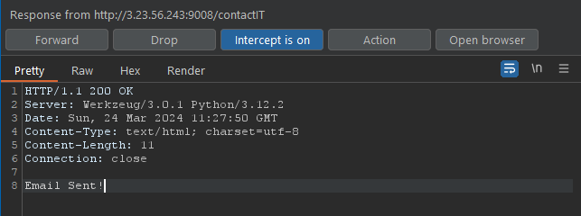

    In our email, we got a new inbox from `texsaw2024@gmail.com`:

    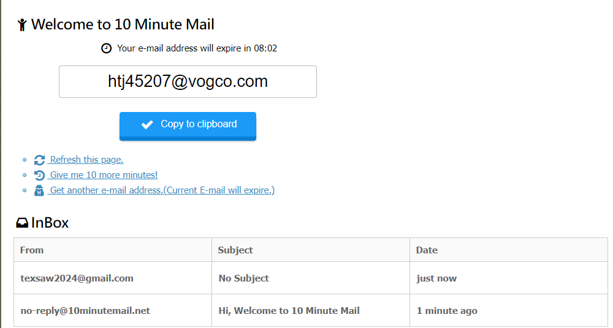

    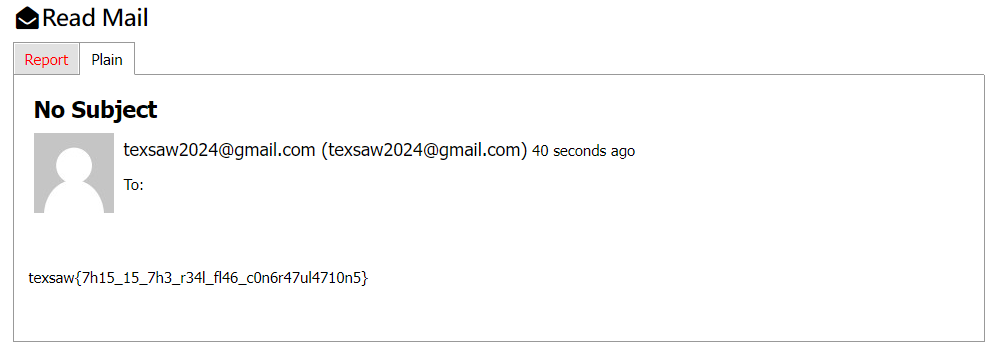

    flag: texsaw{7h15_15_7h3_r34l_fl46_c0n6r47ul4710n5}

2. /countdown


    While in this endpoint, it doesnt contain anything. It just provides an image.