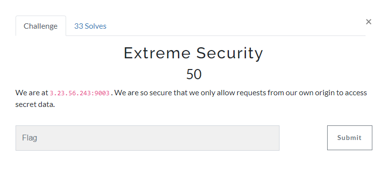
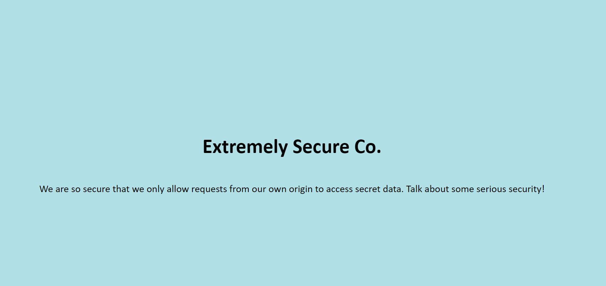
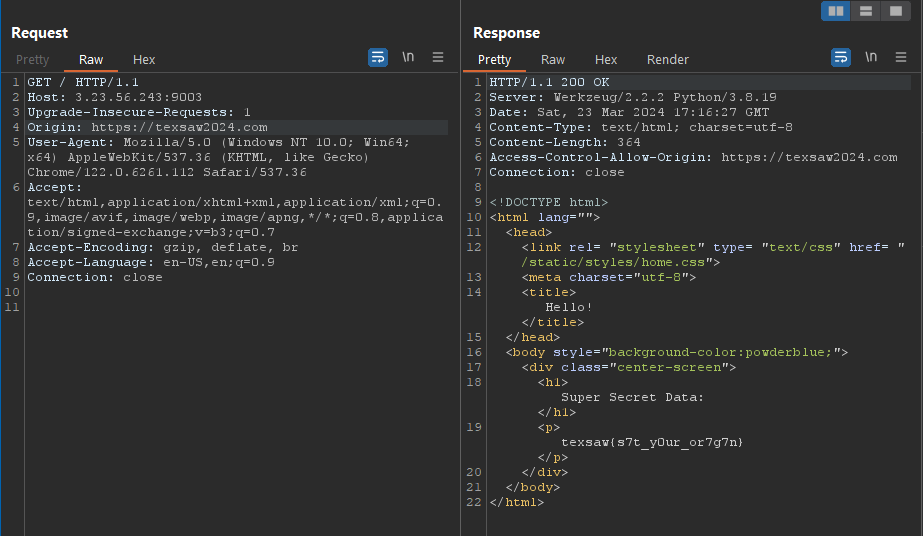

challenge:

This challenge seems to be related to the concept of Cross-Origin Resource Sharing (CORS), which is a mechanism that allows many resources (e.g., fonts, JavaScript, etc.) on a web page to be requested from another domain outside the domain from which the resource originated.

In this case, the server only allows requests from its own origin (https://texsaw2024.com) to access secret data, as indicated by the Access-Control-Allow-Origin header in the response. This suggests that the challenge might involve crafting a request that appears to come from the allowed origin.

Here’s a potential way to solve it:

1. Intercept the Request: Use a tool like Burp Suite to intercept the request to the server.
2. Modify the Origin: In the intercepted request, change the Origin header to https://texsaw2024.com.
3. Forward the Request: Forward the modified request to the server.

This should trick the server into thinking that the request is coming from its own origin, thereby granting access to the secret data.

To solve this:
- using curl: 
curl -H "Origin: https://texsaw2024.com" http://3.23.56.243:9003/
- using burp: 

flag: texsaw{s7t_y0ur_or7g7n} 