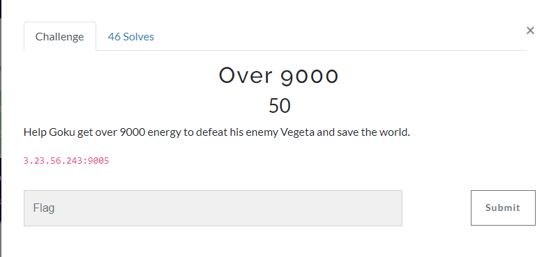
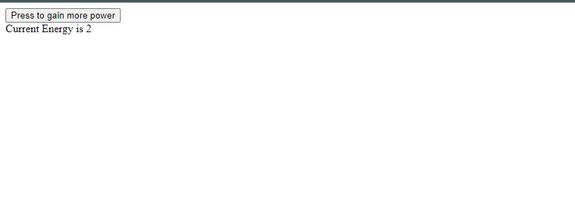

challenge site:




9000.js:


```
let currentEnergy = 0;

function gatheringEnergy(){
    currentEnergy++;
    $("#energycount").html(`${currentEnergy}`);
    if(currentEnergy == 10)
    {
        alert("out of energy try again :(")
        currentEnergy = 0;
        $("#energycount").html(0);
        
    }
    else if (currentEnergy > 9000)
    {
        
        $.ajax({
            type:"POST",
            url:"kamehameha.php",
            data:{energy: currentEnergy},
            success: function(flag){
                alert(`${flag}`);
            },
            error: function(responseText,status, error){
                console.log(`Tell the infrastructure team to fix this: Status = ${status} ; Error = ${error}`);
            }


        })
        
    }
}
```

To solve this challenge, we have to hit the currentEnergy more than 9000 then it will do a POST request to kamehameha.php endpoint and reveal the flag. To do this: 
- curl -X POST -d "energy=9001" http://3.23.56.243:9005/kamehameha.php

flag: texsaw{y0u_th0ught_th1s_w4s_4_fl4g_but_1t_w4s_m3_d10}

